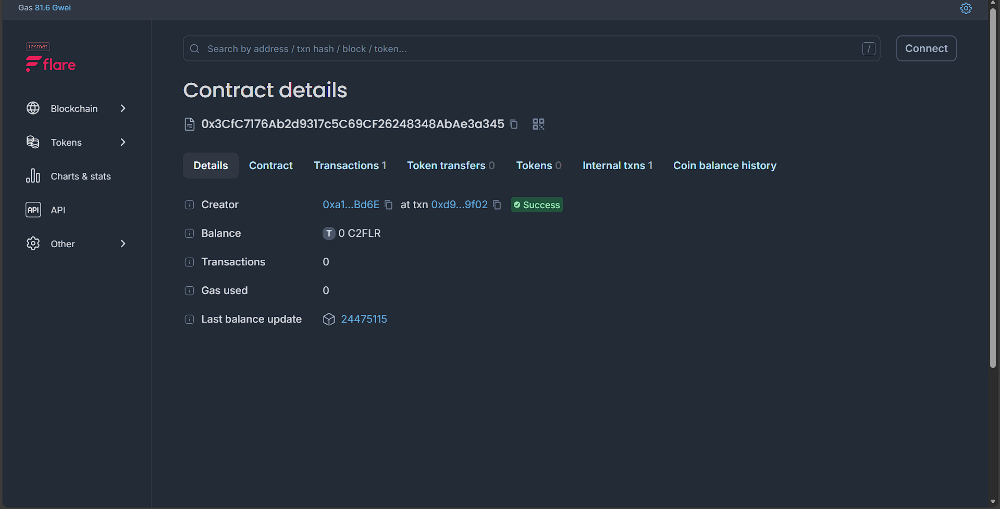

# Random Emoji Smart Contract UI

## **Contract Address**
`0x3CfC7176Ab2d9317c5C69CF26248348AbAe3a345`  
https://coston2-explorer.flare.network/address/0x3CfC7176Ab2d9317c5C69CF26248348AbAe3a345

---

## **Description**

This project provides a simple, wallet-connected web interface for interacting with a deployed smart contract on the Flare Coston2 network.  
The contract exposes a single read-only function, **`getRandomEmoji()`**, which returns a random emoji string on each call.

The frontend is built using **Next.js**, **TypeScript**, **wagmi**, and **viem**, offering a clean and reactive UI for users to connect their wallet and fetch data from the blockchain.

---

## **Features**

### 🔗 **Wallet Connection**
- Seamless integration with wagmi for connecting any supported Web3 wallet.
- UI elements auto-update based on wallet connection state.

### 😀 **Random Emoji Fetching**
- Calls the smart contract's `getRandomEmoji()` method.
- Displays the emoji in a styled UI card.
- Includes a refresh button to fetch a new emoji.

### ⚡ **Live Contract Interaction**
- Uses wagmi’s `useReadContract()` hook for real-time updates.
- Handles wallet gating, loading states, and error conditions.

### 🛡️ **Error-Resilient Architecture**
- Graceful error handling for RPC/network/contract failures.
- Clear feedback displayed in the UI.

---

## **How It Solves the Problem**

Smart contracts often expose functions that users want to test or interact with quickly without building a full dApp.  
This project provides:

### ✔ A minimal, production-ready **template** for reading data from a blockchain contract  
### ✔ A simple UX for developers, testers, and demo environments  
### ✔ A clean abstraction via a custom React hook (`useWillContract`)  
### ✔ Automatic loading and error feedback for better developer experience  

### **Use Cases**
- Testing smart contract read functions
- Providing demos or prototype UIs for blockchain teams
- Serving as a boilerplate for expanding into a larger dApp
- Teaching how to integrate wagmi/viem with a live contract

### **Benefits**
- Eliminates repetitive setup for contract interaction
- Shortens development time for frontend-blockchain integration
- Encourages modular and scalable architecture

---

This project can be easily extended to support additional contract methods, write transactions, events, or more advanced dApp features.
